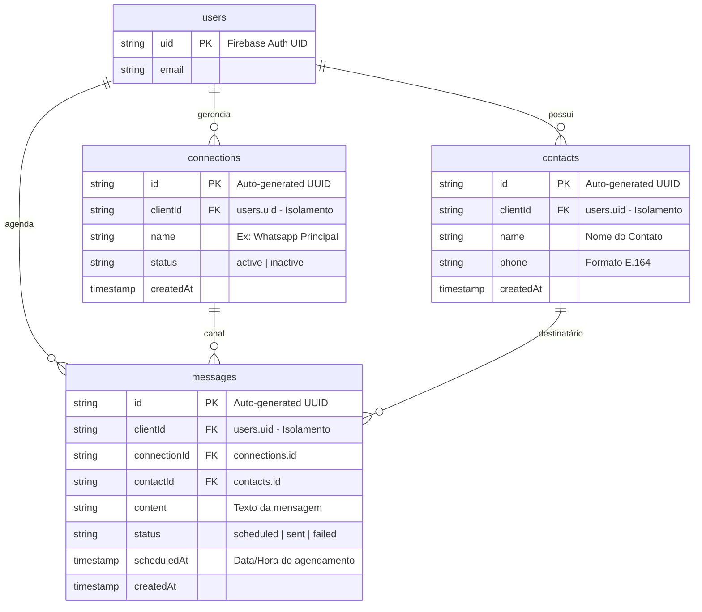

# Broadcast — Plataforma SaaS de Mensageria

O **Broadcast** é uma plataforma SaaS multitenant moderna e de alto desempenho projetada para o gerenciamento centralizado de conexões de mensageria, contatos e agendamento de mensagens em tempo real.

---

## O Problema a Resolver

Empresas de todos os tamanhos necessitam gerenciar listas de contatos e disparar mensagens (tanto imediatas quanto agendadas) através de diferentes conexões ou canais de comunicação. 

Os principais desafios resolvidos pelo **Broadcast** são:
1. **Isolamento de Dados Estrito (Multitenancy)**: Garantir que o Cliente A jamais visualize, altere ou tenha acesso aos dados do Cliente B (seja conexões, contatos ou mensagens) a nível de banco de dados.
2. **Envio Agendado Escalável**: Permitir o agendamento de mensagens com precisão de minutos, sem sobrecarregar o banco de dados com buscas ineficientes e custosas.
3. **Sincronização em Tempo Real**: Atualizar o painel do usuário instantaneamente quando um agendamento for disparado com sucesso pelo servidor ou quando houver mudanças no estado das conexões e contatos.

---

## Stack Tecnológica

O ecossistema do projeto é dividido de forma otimizada entre frontend e infraestrutura serveless na nuvem:

| Camada | Tecnologia | Propósito / Benefício |
| :--- | :--- | :--- |
| **Frontend** | React 19 + TypeScript | Interface ultra responsiva, tipagem estrita contra bugs e renderização veloz. |
| **Tooling** | Vite 8 | Ferramenta de build de última geração com hot-reload instantâneo em desenvolvimento. |
| **Design / UI** | MUI v9 + Emotion | Biblioteca de design premium que entrega componentes modernos e transições suaves. |
| **Roteamento** | React Router 7 | Controle de rotas dinâmicas e proteção de páginas autenticadas. |
| **Banco de Dados** | Cloud Firestore | Banco NoSQL altamente escalável com escuta real-time activa (`onSnapshot`). |
| **Autenticação** | Firebase Auth | Gerenciamento de credenciais seguro e base para o isolamento de tenants. |
| **Processamento** | Cloud Functions (Node.js 24) | Execuções serverless robustas com escalabilidade automática rápida. |
| **Agendador** | Cloud Scheduler | Gatilho cron na nuvem que executa a rotina de envio minuto a minuto de forma garantida. |

---

## Modelagem de Dados (DER das Coleções)

O banco de dados Firestore foi planejado em uma arquitetura **Flat (plana)** sem subcoleções internas. Isso nos permite realizar consultas compostas de alta velocidade e cruzar dados com eficiência total de custos e indexação.

### Diagrama Entidade-Relacionamento (DER)



---

## Arquitetura de Segurança (Firestore Rules)

Para garantir segurança máxima contra vazamento de dados corporativos, o sistema utiliza o mecanismo declarativo do Firestore. Nenhuma leitura ou escrita é executada se o `clientId` contido no documento não corresponder exatamente ao ID do usuário logado que faz a requisição.

Exemplo conceitual de nossa regra de proteção:
```javascript
rules_version = '2';
service cloud.firestore {
  match /databases/{database}/documents {
    
    // Função auxiliar para verificar se o usuário é dono do documento
    function isOwner(resourceData) {
      return request.auth != null && resourceData.clientId == request.auth.uid;
    }

    match /connections/{connectionId} {
      allow read, write: if isOwner(resource.data) || (resource == null && request.resource.data.clientId == request.auth.uid);
    }
    
    match /contacts/{contactId} {
      allow read, write: if isOwner(resource.data) || (resource == null && request.resource.data.clientId == request.auth.uid);
    }

    match /messages/{messageId} {
      allow read, write: if isOwner(resource.data) || (resource == null && request.resource.data.clientId == request.auth.uid);
    }
  }
}
```

---

## Mecanismo de Disparo de Agendamentos

O envio das mensagens agendadas é gerenciado no backend por uma **Cloud Function de 2ª Geração** executada de forma recorrente.

1. **Gatilho**: O Cloud Scheduler chama a Cloud Function `processScheduledMessages` a cada 1 minuto (`* * * * *`).
2. **Busca Otimizada**: A função executa uma query buscando no Firestore mensagens cujo status seja `scheduled` e cujo `scheduledAt` seja menor ou igual à data e hora atual do servidor (UTC).
3. **Atomicidade e Transações**: Cada lote de mensagens expiradas é atualizado para `sent` de forma transacionada individualmente, prevenindo disparos duplicados em caso de concorrência ou reexecuções.
4. **Atualização Reativa**: Como o frontend do cliente escuta a coleção `messages` através do hook de tempo real `useMessages.ts`, assim que o status no banco muda para `sent`, a tela do usuário pisca em verde instantaneamente.

---

## Como Rodar o Projeto Localmente

### Pré-requisitos
* Node.js v24 (ou superior)
* Firebase CLI instalado globalmente (`npm install -g firebase-tools`)

### 1. Configurando o Frontend
Abra a pasta `web/` e configure o arquivo de variáveis de ambiente:
```bash
cd web
# Crie um arquivo .env.local com suas credenciais do Firebase
VITE_FIREBASE_API_KEY="sua_api_key"
VITE_FIREBASE_AUTH_DOMAIN="seu_auth_domain"
VITE_FIREBASE_PROJECT_ID="broadcast-saas-crud"
VITE_FIREBASE_STORAGE_BUCKET="seu_storage_bucket"
VITE_FIREBASE_MESSAGING_SENDER_ID="seu_sender_id"
VITE_FIREBASE_APP_ID="seu_app_id"
```

Instale as dependências com versões rigidamente travadas e inicie o servidor:
```bash
npm install
npm run dev
```

### 2. Configurando o Backend (Cloud Functions)
Acesse a pasta `functions/` e inicie o compilador:
```bash
cd ../functions
npm install
npm run build
```

---

## Como Fazer o Deploy em Produção

O projeto está totalmente configurado para deploy via Firebase. Para enviar regras de segurança, índices de banco, site estático compilado e Cloud Functions de uma só vez, utilize o comando:

```bash
firebase deploy --force
```

> **Nota:** A tag `--force` é utilizada para permitir que o Firebase configure de forma totalmente automatizada a política de limpeza (cleanup policy) do Artifact Registry na região de São Paulo (`southamerica-east1`), economizando custos desnecessários com o acúmulo de imagens antigas de container.

---

## Certificação e Testes E2E (Playwright)

Durante a fase final de homologação, o projeto foi submetido a um teste de ponta a ponta (E2E) robusto com **Playwright** rodando diretamente contra o ambiente de produção.

O robô de testes simulou com sucesso:
1. Criação de conta em tempo real com credenciais dinâmicas.
2. Criação de nova Conexão.
3. Cadastro de novo Contato (com validação de máscara de telefone).
4. Seleção da conexão, composição de mensagem e disparo imediato.
5. Validação em tempo real do status **ENVIADO** via Websockets (`onSnapshot`).

**Resultado do Teste:** `1 passed (5.4s)` — validado com sucesso e homologado com regressão zero.

> Conforme decisão arquitetural **ADR-011**, os arquivos de configuração de testes e a dependência do Playwright foram removidos após a homologação para entregar ao cliente um repositório extremamente leve, focado e de alta performance.

---

## CI/CD — Pipeline de Deploy Automatizado (GitHub Actions)

O projeto conta com uma esteira de integração e entrega contínuas (CI/CD) profissional via **GitHub Actions**, configurada no arquivo [`.github/workflows/deploy.yml`](file:///.github/workflows/deploy.yml).

### Como funciona
Sempre que novos códigos são enviados à branch `main` via `push` ou `pull request` (merge):
1. O GitHub inicia um container Linux (`ubuntu-latest`).
2. Configura o ambiente Node.js v24.
3. Instala dependências e compila o Frontend (`web`) com validação estrita do compilador TS.
4. Instala dependências e compila as Cloud Functions (`functions`).
5. Dispara o deploy unificado e seguro (`firebase deploy --force`) de regras do Firestore, índices, Hosting e Functions.

### Como ativar em seu repositório
1. Gere o token no terminal: `firebase login:ci`
2. No seu repositório do GitHub, vá em **Settings** > **Secrets and variables** > **Actions** > **New repository secret**.
3. Crie um segredo com o nome `FIREBASE_TOKEN` e cole o valor gerado.
4. Commit e envie o arquivo `.github/workflows/deploy.yml` para disparar a primeira execução automática!

---

## Roadmap — Próximas Evoluções Naturais

A arquitetura do Broadcast foi projetada com expansão em mente. Os blocos de construção necessários (conexões como canais, contatos com telefone E.164, Cloud Function de processamento agendado) estão todos prontos para suportar as seguintes integrações sem refatoração estrutural:

### Integração com WhatsApp (Camada de Disparo Real)

A entidade `Connection` representa hoje um canal de mensageria configurável. O próximo passo natural é conectá-la a um provedor real de envio:

| Abordagem | Características | Adequado Para |
| :--- | :--- | :--- |
| **WhatsApp Business API (Meta Oficial)** | API REST estável, suporte oficial, sem risco de bloqueio de conta | Produção, clientes empresariais |
| **Baileys (Protocolo não-oficial)** | Open source, sem custo por mensagem, requer Node persistente (Cloud Run) | MVPs, projetos internos, alto volume |

**Como o Broadcast suportaria Baileys:**
A Cloud Function `processScheduledMessages` atual marca mensagens como `sent` de forma simbólica. Para integrar um provedor real:
1. Substituir o `batch.update({ status: 'sent' })` por uma chamada HTTP ao serviço de envio (Baileys rodando em Cloud Run ou WhatsApp Business API).
2. O resultado do envio (sucesso/falha) determina se o status é atualizado para `sent` ou `failed`.
3. O frontend já consome o campo `status` via `onSnapshot` e reflete instantaneamente — zero mudança no frontend.

### Outras Evoluções Mapeadas

- **Dashboard Analytics** — queries agregadas no Firestore para taxa de envio, mensagens por conexão e histórico temporal.
- **Webhooks de Entrega** — receber callbacks de status de entrega do WhatsApp Business API e atualizar o campo `status` via Cloud Function HTTP trigger.
- **Multi-usuário por Tenant** — hoje cada `clientId` é um `auth.uid` individual. A arquitetura flat permite evoluir para um modelo de organização (`orgId`) sem reestruturar as coleções.